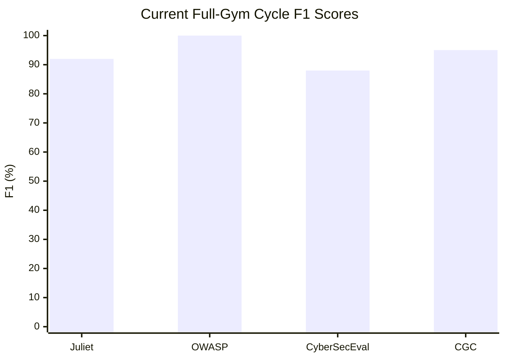

# Gym Cycle Dashboard

| Benchmark | Mode | Cases | F1 | Precision | Recall |
|-----------|------|-------|----|-----------|--------|
| **Juliet** | hybrid | 30 | 92.0% | 100.0% | 85.2% |
| **OWASP** | hybrid | 30 | 100.0% | 100.0% | 100.0% |
| **CyberSecEval** | hybrid | 30 | 87.5% | 100.0% | 77.8% |
| **CGC** | pattern-only | 10 | 94.7% | 100.0% | 90.0% |

> CGC's completed artifact is a pattern-only capped follow-up. The attempted hybrid 30-case CGC path was throughput-bound.
